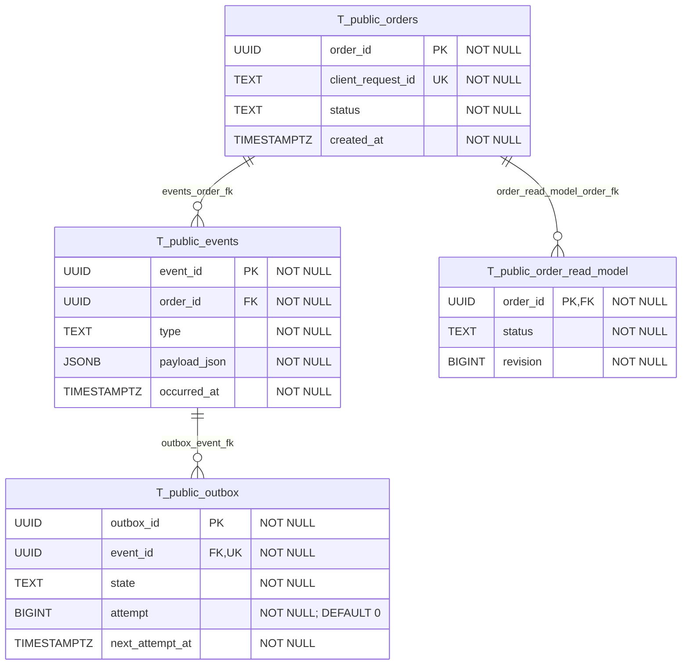

# Database Schema / 数据库结构

> Tables / 数据表: 4; Foreign keys / 外键: 3.

```mermaid
erDiagram
  T_public_orders {
    UUID order_id PK "NOT NULL"
    TEXT client_request_id UK "NOT NULL"
    TEXT status "NOT NULL"
    TIMESTAMPTZ created_at "NOT NULL"
  }
  T_public_events {
    UUID event_id PK "NOT NULL"
    UUID order_id FK "NOT NULL"
    TEXT type "NOT NULL"
    JSONB payload_json "NOT NULL"
    TIMESTAMPTZ occurred_at "NOT NULL"
  }
  T_public_outbox {
    UUID outbox_id PK "NOT NULL"
    UUID event_id FK,UK "NOT NULL"
    TEXT state "NOT NULL"
    BIGINT attempt "NOT NULL; DEFAULT 0"
    TIMESTAMPTZ next_attempt_at "NOT NULL"
  }
  T_public_order_read_model {
    UUID order_id PK,FK "NOT NULL"
    TEXT status "NOT NULL"
    BIGINT revision "NOT NULL"
  }
  T_public_orders ||--o{ T_public_events : "events_order_fk"
  T_public_events ||--o{ T_public_outbox : "outbox_event_fk"
  T_public_orders ||--o{ T_public_order_read_model : "order_read_model_order_fk"
```
